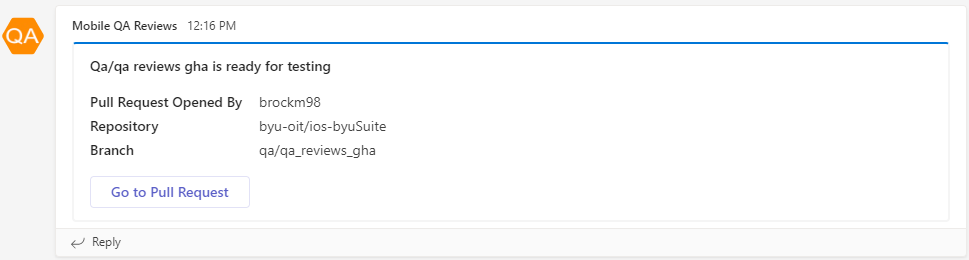

# github-action-qa-reviews

# QA Reviews Teams Notification

This Github Action sends a notification to Teams saying if a Pull Request Comment contains 'QA_TEST', then it will send a notification to a Teams channel named something like "`TEAM_NAME_HERE` QA Reviews". 

The notification would tell the user the following:
- `Commit message here` is ready for testing
- Who opened the Pull Request
- What Repository the Pull Request
- What Branch the pull request came from
- A link to the Pull Request

# Usage

Checkout the "usage.yml" file to see exactly how you would use this action. In general, it looks like
```
    on:
        pull_request_review:
    
    - name: msg_v2
    id: example_flow
    uses: byu-oit/github-action-qa-reviews@v1.0
    with:
        MS_TEAMS_WEBHOOK_URL: ${{ secrets.MS_TEAMS_WEBHOOK_URL }}
```
First, create a Teams channel within your team called '`Team name here` QA Reviews' <br>

Create an incoming webhook in teams, following [these instructions](https://docs.microsoft.com/en-us/microsoftteams/platform/webhooks-and-connectors/how-to/add-incoming-webhook#create-incoming-webhook-1), be sure to save the webhook url. Create a GitHub secret `MS_TEAMS_WEBHOOK_URL` and set the value to the URL of your new incoming webhook. This determines where the notification will be sent. 

The step will need an ID, which shows up in the title of the card notification (The workflow...) The tag (`@v1.0` in the examples) is the name of the branch or tag that the event came from.

# Results
This is an example of what the message will look like in Teams.


